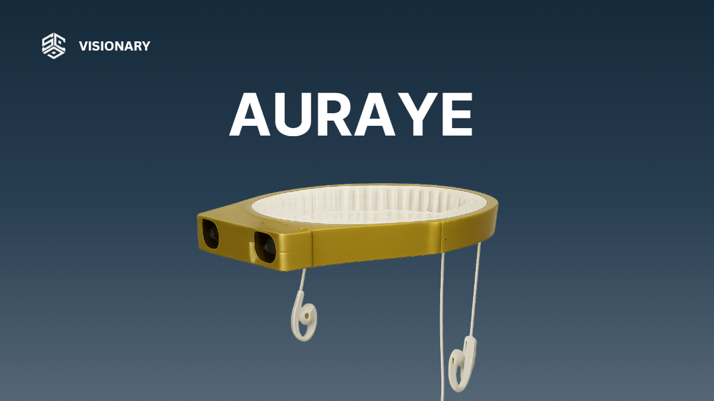

# Auraye — AI Navigation Assistant for the Visually Impaired

**Vietnam-Japan AI Hackathon 2025 — Top 5 Finalist**

<p align="center">
  
</p>

Auraye is an offline, real-time AI navigation assistant designed to help visually impaired individuals navigate safely. It uses stereo vision depth estimation and object detection to identify obstacles, people, and vehicles, then communicates spatial information through directional audio cues and voice commands.

## Features

- **Real-time object detection** — YOLOv8n fine-tuned on Open Images V7 (person & bicycle classes), running via TensorFlow Lite for edge deployment
- **Stereo vision depth estimation** — OpenCV StereoBM computes disparity maps from a dual-camera setup to estimate distances to detected objects
- **Multi-object tracking** — ByteTrack maintains consistent object IDs across frames for smooth tracking
- **Spatial audio feedback** — Directional beeping (stereo panning) indicates object position; beep frequency increases as threats get closer
- **Voice commands** — Text-to-speech announces object type and clock-position direction (e.g., "person at 11 o'clock")
- **Edge deployment** — Runs on Raspberry Pi 4 with TF Lite, multithreaded architecture for parallel AI inference and audio output
- **Camera auto-recovery** — Automatically reconnects if the camera feed is lost

## System Architecture

```
Stereo Camera Input
        |
   +---------+---------+
   |                   |
Left Image         Right Image
   |                   |
   +----> StereoBM <---+
   |      (depth)
   |
   +----> YOLOv8n + ByteTrack (detection & tracking)
   |
   +----> Threat Assessment
   |         |
   |    +----+----+
   |    |         |
   | Spatial    Voice
   | Audio      Commands
   | (beeping)  (espeak TTS)
```

## Tech Stack

| Component | Technology |
|-----------|-----------|
| Object Detection | YOLOv8n (Ultralytics), fine-tuned on Open Images V7 |
| Model Format | TensorFlow Lite (float16, float32, int8 variants) |
| Depth Estimation | OpenCV StereoBM (stereo disparity) |
| Object Tracking | ByteTrack |
| Audio Feedback | NumPy waveform generation, `aplay` (ALSA) |
| Voice Commands | `espeak` TTS |
| Data Collection | FiftyOne (Open Images V7 dataset) |
| Training | YOLOv8n, trained on FPT AI Factory GPU VM (NVIDIA H200) |
| Hardware | Raspberry Pi 4, dual USB cameras (stereo pair) |

## Project Structure

```
Auraye/
├── Auraeye_raspi_final.py    # Main application (runs on Raspberry Pi)
├── model_yolov8n.tflite      # Fine-tuned YOLOv8n model (TF Lite)
├── Product_image.png         # Product photo
├── requirements.txt
├── README.md
└── .gitignore
```

## How It Works

1. **Stereo camera** captures left/right frames simultaneously
2. **StereoBM** computes a disparity map to estimate depth at every pixel
3. **YOLOv8n** detects people and bicycles in the left frame (runs in a separate thread)
4. **ByteTrack** maintains persistent object IDs across frames
5. **Threat assessment** combines object class, distance, and position:
   - Objects within danger distance → rapid directional beeping (spatial audio)
   - Objects detected but farther away → voice announcement with clock position
   - Obstacles in ROI zones (left/center/right) → maximum alert
6. **Audio output** is stereo-panned based on object position in the frame

## Setup

### Prerequisites

- Raspberry Pi 4 (or Linux machine with stereo cameras)
- Python 3.9+
- Stereo camera pair (USB webcams)
- Speaker/headphones

### Installation

```bash
git clone https://github.com/vatine12/Auraye.git
cd Auraye
pip install -r requirements.txt
sudo apt-get install espeak alsa-utils
```

### Running

```bash
python Auraeye_raspi_final.py
```

> **Note:** The model was trained on a custom dataset (500 bicycle + person images from Open Images V7, collected via FiftyOne) using an FPT AI Factory GPU VM (NVIDIA H200), then converted to TensorFlow Lite for edge deployment.

## Configuration

Key parameters in `Auraeye_raspi_final.py`:

| Parameter | Default | Description |
|-----------|---------|-------------|
| `BASELINE` | 0.062 m | Physical distance between stereo cameras |
| `FOCAL_LENGTH` | 185 px | Camera focal length in pixels |
| `DIST_PERSON_LIMIT` | 3.0 m | Danger distance for persons |
| `DIST_BIKE_LIMIT` | 3.0 m | Danger distance for bicycles |
| `DIST_OBSTACLE_LIMIT` | 0.5 m | Danger distance for generic obstacles |
| `CAM_FOV_DEG` | 120.0° | Camera field of view |

## Team

Built by a team of 5 at the Vietnam-Japan AI Hackathon (December 2025). I served as **team leader** and **ML engineer**, responsible for the full ML pipeline: data collection, model training, stereo vision, tracking, spatial audio, and edge deployment.

## License

MIT License
